# Unplug — Digital Detox

**Unplug** is a teen-focused digital wellness platform where members build healthier screen habits with coach support. Members log daily check-ins (screen time, sleep, mood), upload screenshots, and track goals. Coaches publish weekly reviews and manage plans. Admins approve coaches and oversee the system.

| Layer | Path | Stack |
|-------|------|-------|
| REST API | [`digital-detox-project/`](digital-detox-project/) | Java 21, Spring Boot 3.5, PostgreSQL, Flyway, JWT |
| Web UI | [`digital-detox-frontend/`](digital-detox-frontend/) | React 19, TypeScript, Vite, Zod, react-hook-form |

This workspace also contains [`edu-rest-app-pro/`](edu-rest-app-pro/), a reference Spring Boot REST app (education domain) used as a patterns source.

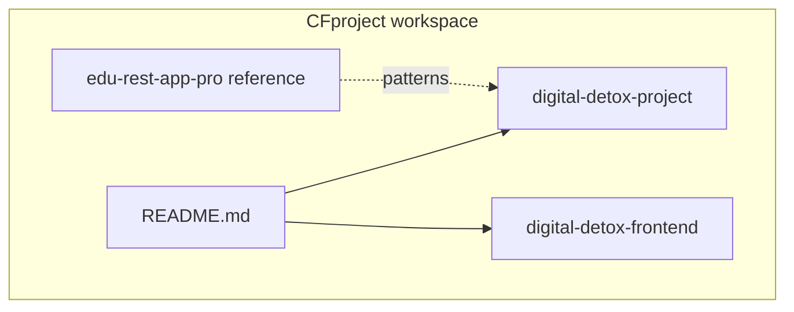

---

## Table of contents

1. [App screenshots](#app-screenshots)
2. [Architecture](#architecture)
3. [Domain model](#domain-model)
4. [Roles and auth](#roles-and-auth)
5. [Prerequisites](#prerequisites)
6. [PostgreSQL setup](#postgresql-setup)
7. [Backend setup](#backend-setup)
8. [Frontend setup](#frontend-setup)
9. [Quick start](#quick-start)
10. [Demo walkthrough](#demo-walkthrough)
11. [Authentication (JWT)](#authentication-jwt)
12. [REST API reference](#rest-api-reference)
13. [File uploads and downloads](#file-uploads-and-downloads)
14. [Frontend UI and routes](#frontend-ui-and-routes)
15. [Testing](#testing)
16. [Configuration reference](#configuration-reference)
17. [Project structure](#project-structure)
18. [Troubleshooting](#troubleshooting)

---

## App screenshots

#### Login page

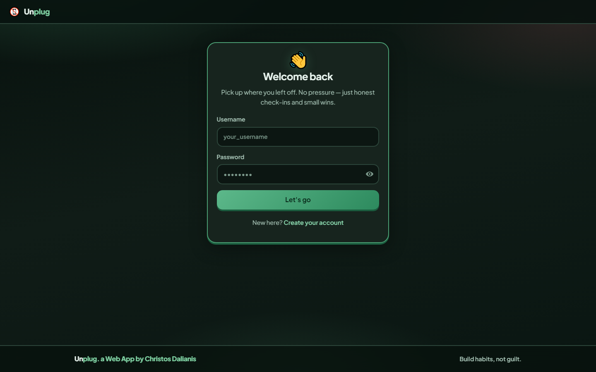

#### Registration page

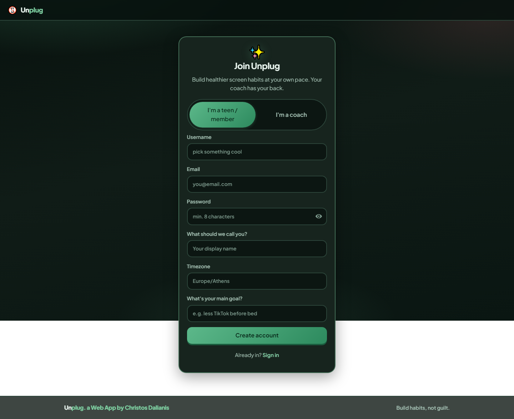

#### Plans dashboard

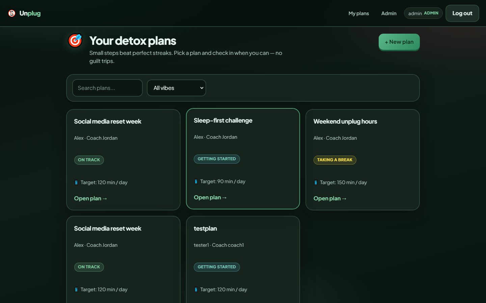

#### Member plan detail

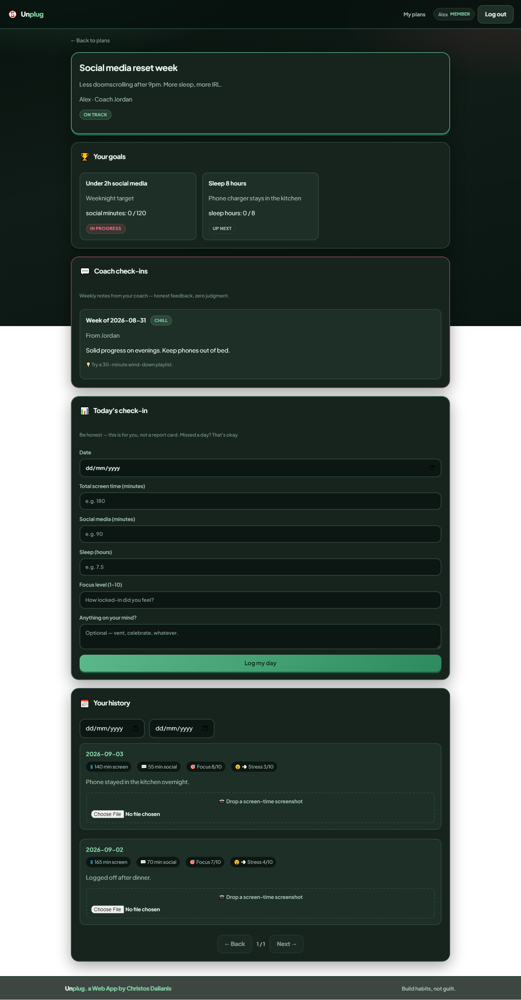

#### Coach plan detail

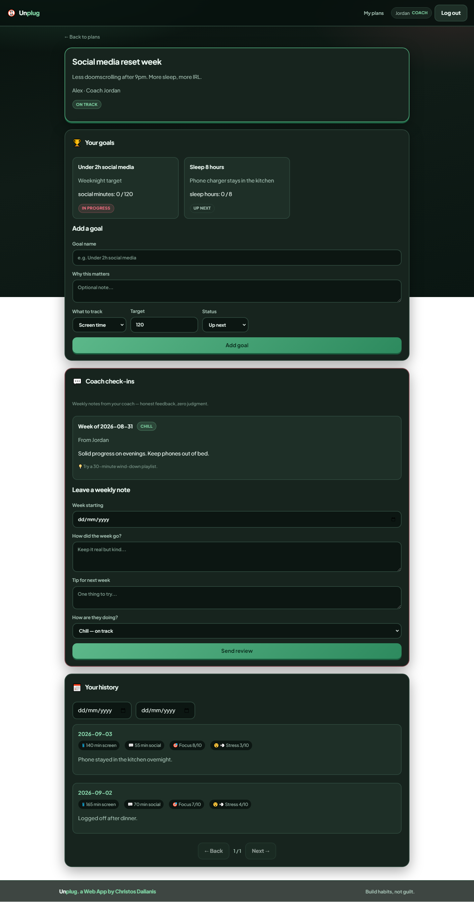

#### Admin coach approvals

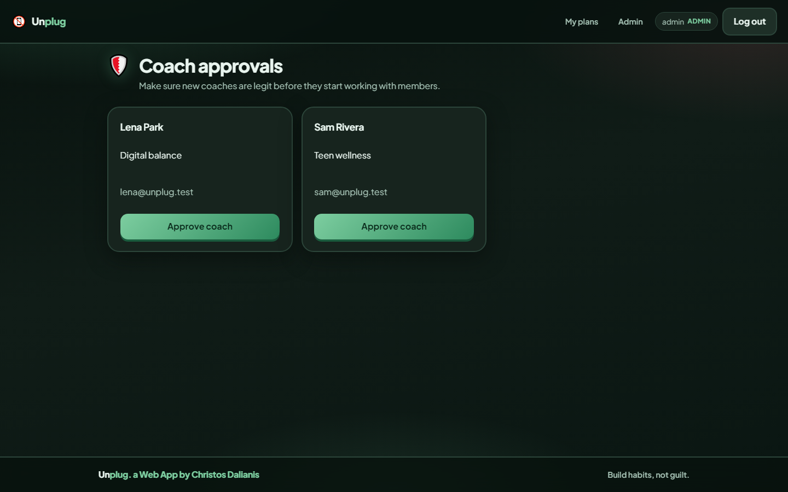

#### First-run onboarding wizard

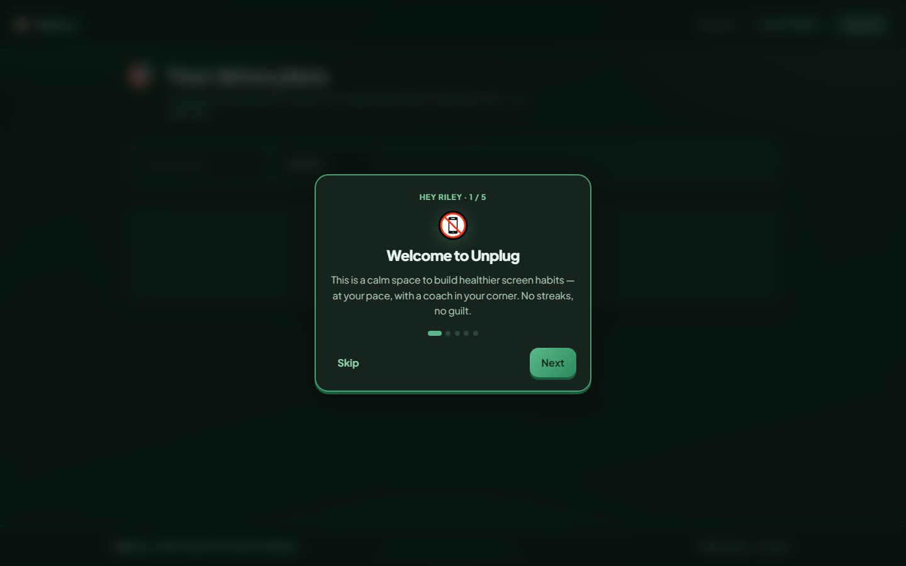

---

## Architecture

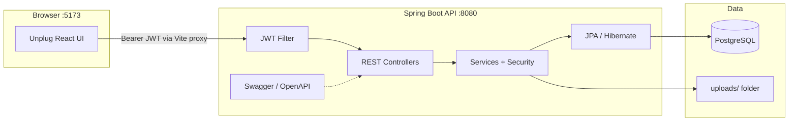

- **Stateless auth:** login returns a JWT; the frontend stores it in `localStorage` and sends `Authorization: Bearer <token>` on every request.
- **Schema management:** Flyway migrations (`V1`–`V3`); Hibernate `ddl-auto=validate` (no auto DDL).
- **Authorization:** role-based capabilities enforced with `@PreAuthorize` and a custom `SecurityService` for plan/check-in ownership checks.
- **Dev proxy:** Vite proxies `/api` → `http://localhost:8080` so the frontend can call the API without CORS issues during development.
- **API docs:** springdoc OpenAPI at `/swagger-ui.html`.

---

## Domain model

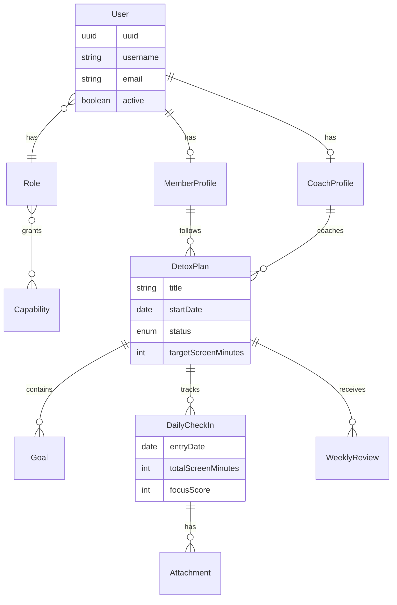

---

## Roles and auth

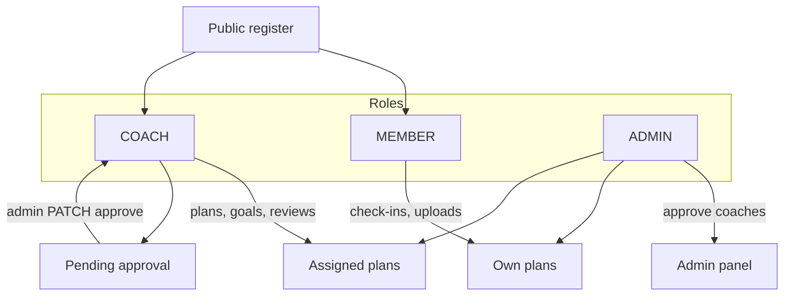

| Role | Description |
|------|-------------|
| `MEMBER` | Follows plans, submits check-ins, uploads attachments |
| `COACH` | Creates plans, goals, weekly reviews (**must be approved by admin**) |
| `ADMIN` | Full access; approves coaches |

Capabilities are fine-grained permissions (e.g. `VIEW_PLANS`, `EDIT_PLAN`, `CREATE_REVIEW`, `UPLOAD_ATTACHMENT`) mapped to roles in `V2` and `V3` migrations. Method-level `@PreAuthorize` checks enforce them at runtime.

---

## Prerequisites

| Tool | Version |
|------|---------|
| JDK | 21 |
| Gradle | Wrapper included (`./gradlew`) |
| PostgreSQL | 14+ recommended |
| Node.js | 20+ recommended |
| npm | 10+ |

---

## PostgreSQL setup

Create the database and application user (run as a PostgreSQL superuser):

```sql
CREATE USER detox_user WITH PASSWORD 'detox_pass';
CREATE DATABASE digitaldetox OWNER detox_user;
GRANT ALL PRIVILEGES ON DATABASE digitaldetox TO detox_user;
```

On first backend startup, **Flyway** applies:

| Migration | Purpose |
|-----------|---------|
| `V1__initial_schema.sql` | Tables: users, roles, capabilities, profiles, plans, goals, check-ins, reviews, attachments |
| `V2__insert_roles_capabilities.sql` | Seeds `ADMIN`, `COACH`, `MEMBER` roles and 15 capabilities |
| `V3__insert_default_admin.sql` | Default admin user + `UPLOAD_ATTACHMENT` capability |

Override connection settings with environment variables if needed:

```bash
export POSTGRES_HOST=localhost
export POSTGRES_PORT=5432
export POSTGRES_DB=digitaldetox
export POSTGRES_USER=detox_user
export POSTGRES_PASSWORD=detox_pass
```

---

## Backend setup

```bash
cd digital-detox-project
./gradlew build      # compile + tests
./gradlew bootRun    # start on http://localhost:8080
```

| Resource | URL |
|----------|-----|
| Swagger UI | [http://localhost:8080/swagger-ui.html](http://localhost:8080/swagger-ui.html) |
| OpenAPI JSON | [http://localhost:8080/v3/api-docs](http://localhost:8080/v3/api-docs) |

**Default profile:** `dev` (`application-dev.properties`)

| Setting | Default |
|---------|---------|
| Server port | `8080` |
| JWT secret | set in `application-dev.properties` |
| JWT expiration | 3 hours (`10800000` ms) |
| Upload directory | `uploads/` |
| Max upload size | 5 MB |
| CORS origins | `http://localhost:5173`, `http://localhost:3000` |

Uploaded files are stored on disk under `file.upload.dir` with metadata in the `attachments` table.

---

## Frontend setup

```bash
cd digital-detox-frontend
npm install
npm run dev      # http://localhost:5173
npm run build    # production build → dist/
```

**Environment** (`.env`):

```env
VITE_API_BASE_URL=/api/v1
```

Vite dev server proxies `/api` to the backend (see `vite.config.ts`).

### Tech highlights

- **Zod** — runtime validation schemas for login, registration, plans, check-ins, goals, and reviews.
- **react-hook-form** + `@hookform/resolvers/zod` — typed forms with validation messages.
- **JWT** — stored in `localStorage`; `apiFetch` and `apiDownload` attach the Bearer token automatically.
- **Teen-friendly UI** — dark sage-green theme, supportive copy, bento cards, Plus Jakarta Sans font, branded as **Unplug**.

---

## Quick start

```bash
# 1. PostgreSQL — see PostgreSQL setup above
# 2. Backend
cd digital-detox-project && ./gradlew bootRun

# 3. Frontend (new terminal)
cd digital-detox-frontend && npm install && npm run dev
```

- Frontend: [http://localhost:5173](http://localhost:5173)
- API / Swagger: [http://localhost:8080/swagger-ui.html](http://localhost:8080/swagger-ui.html)
- Demo admin: `admin` / `Admin123!`

---

## Demo walkthrough

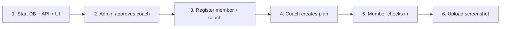

### 1. Start everything

1. Ensure PostgreSQL is running with the `digitaldetox` database.
2. Start the backend: `./gradlew bootRun` in `digital-detox-project`.
3. Start the frontend: `npm run dev` in `digital-detox-frontend`.

### 2. Admin approves coaches

| Field | Value |
|-------|-------|
| Username | `admin` |
| Password | `Admin123!` |

1. Open [http://localhost:5173/login](http://localhost:5173/login).
2. Log in as admin.
3. Go to **Admin** → approve pending coaches.

### 3. Register users

At [http://localhost:5173/register](http://localhost:5173/register):

- Register a **member** (immediate access, then a short first-run onboarding wizard).
- Register a **coach** (requires admin approval before creating plans).

### 4. Coach creates a plan

1. Log in as the approved coach.
2. Go to **My plans** → create a plan for a member.
3. Open the plan detail page:
   - Add **goals** (screen time, social minutes, etc.).
   - Add a **weekly review** with risk level and recommendations.

### 5. Member checks in

1. Log in as the member assigned to the plan.
2. Open the plan → **Log my day** (daily check-in).
3. Upload a screenshot (image or PDF) on an existing check-in.
4. Click an attachment filename to **download** it.

---

## Authentication (JWT)

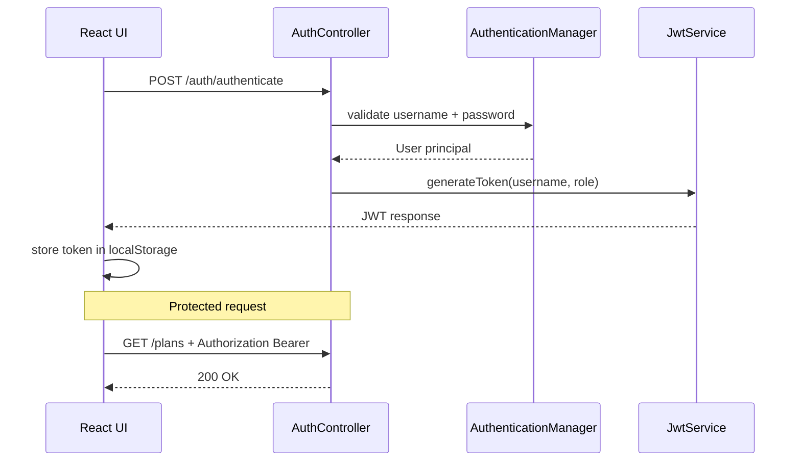

### Login

```http
POST /api/v1/auth/authenticate
Content-Type: application/json

{
  "username": "admin",
  "password": "Admin123!"
}
```

**Response:**

```json
{
  "token": "<jwt>",
  "role": "ADMIN",
  "displayName": "admin"
}
```

### Using the token

```http
GET /api/v1/plans
Authorization: Bearer <jwt>
```

The React app saves `token`, `role`, and `displayName` in `localStorage` via `AuthContext`.

### Public endpoints (no JWT)

- `POST /api/v1/auth/authenticate`
- `POST /api/v1/members/register`
- `POST /api/v1/coaches/register`
- Swagger UI and OpenAPI docs

---

## REST API reference

Base path: `/api/v1` — all endpoints below require JWT unless marked **public**.

### Auth

| Method | Path | Description |
|--------|------|-------------|
| POST | `/auth/authenticate` | Login (**public**) |

### Members

| Method | Path | Description |
|--------|------|-------------|
| POST | `/members/register` | Register member (**public**) |
| GET | `/members` | List members (coach/admin) |
| GET | `/members/me` | Current member profile |
| PUT | `/members/me` | Update current profile |
| GET | `/members/{uuid}` | Get member by UUID |

### Coaches

| Method | Path | Description |
|--------|------|-------------|
| POST | `/coaches/register` | Register coach (**public**) |
| GET | `/coaches` | List coaches |
| GET | `/coaches/pending` | Pending approval (admin) |
| PATCH | `/coaches/{uuid}/approve` | Approve coach (admin) |
| GET | `/coaches/{uuid}` | Get coach by UUID |
| PUT | `/coaches/me` | Update current coach profile |

### Detox plans

| Method | Path | Description |
|--------|------|-------------|
| POST | `/plans` | Create plan |
| GET | `/plans` | List plans (paginated; role-scoped filters) |
| GET | `/plans/{uuid}` | Plan detail |
| PUT | `/plans/{uuid}` | Update plan |
| PATCH | `/plans/{uuid}/status` | Change plan status |

**Pagination query params:** `page`, `size`, `sort`, plus filters (`status`, `memberProfileUuid`, etc.).

### Goals

| Method | Path | Description |
|--------|------|-------------|
| POST | `/plans/{planUuid}/goals` | Add goal (assigned coach) |
| GET | `/plans/{planUuid}/goals` | List goals |

### Weekly reviews

| Method | Path | Description |
|--------|------|-------------|
| POST | `/plans/{planUuid}/reviews` | Create review (assigned coach) |
| GET | `/plans/{planUuid}/reviews` | List reviews |

### Daily check-ins

| Method | Path | Description |
|--------|------|-------------|
| POST | `/plans/{planUuid}/check-ins` | Submit check-in |
| GET | `/plans/{planUuid}/check-ins` | List check-ins (paginated; `fromDate`, `toDate` filters) |

### Attachments

| Method | Path | Description |
|--------|------|-------------|
| POST | `/check-ins/{checkInUuid}/attachments` | Upload file (`multipart/form-data`, field `file`) |
| GET | `/check-ins/{checkInUuid}/attachments` | List attachment metadata |
| GET | `/check-ins/{checkInUuid}/attachments/{attachmentUuid}` | **Download** file |

---

## File uploads and downloads

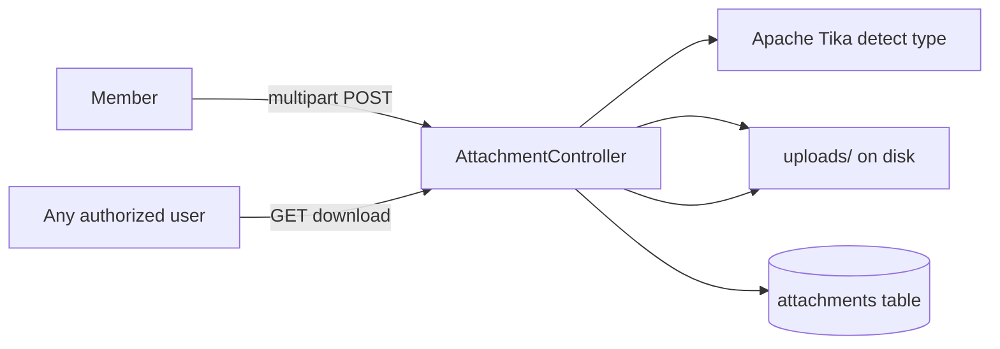

### Upload

- **Who:** member who owns the check-in (or admin).
- **Formats:** images and PDF (validated via Apache Tika content-type detection).
- **Max size:** 5 MB (configurable in `application-dev.properties`).
- **Storage:** `uploads/<uuid>.<ext>` on disk; metadata in PostgreSQL.

### Download

- **Who:** anyone with `VIEW_CHECKINS` or `VIEW_OWN_CHECKINS`.
- **Response:** binary stream with `Content-Disposition: attachment` and correct `Content-Type`.
- **Frontend:** click attachment name on the plan detail page; uses `apiDownload()` with JWT.

---

## Frontend UI and routes

The UI is branded **Unplug** and designed for teens: dark sage-green theme, supportive guilt-free copy, bento cards, emoji section headers, and human-readable status labels.

After a new member or coach registers, they are signed in and a short **onboarding wizard** explains the first steps for their role (plans, check-ins, goals, coach approval). It appears only on that first use; Skip or Let’s go dismisses it.

```mermaid
flowchart TD
  Login[/login] --> Plans[/plans]
  Register[/register] --> Wizard[Onboarding wizard]
  Wizard --> Plans
  Plans --> Detail[/plans/:uuid]
  Plans --> Admin[/admin]
  Admin -->|ADMIN only| Approve[Coach approvals]
```

| Route | Access | Features |
|-------|--------|----------|
| `/login` | Public | Zod login, password visibility toggle |
| `/register` | Public | Member / coach registration tabs |
| `/plans` | Authenticated | Bento plan grid, filters, create plan (coach/admin) |
| `/plans/:uuid` | Authenticated | Goals, coach reviews, check-ins, upload/download |
| `/admin` | Admin | Approve pending coaches |

Protected routes redirect to `/login` when no JWT is present.

---

## Testing

### Unit tests

```bash
cd digital-detox-project
./gradlew test
```

JUnit 5 + Mockito tests cover:

- **DetoxPlanService** — create plan (approved coach, unapproved coach, missing member), get/update status
- **CheckInService** — create check-in, duplicate date, missing plan
- **CoachService** — approve coach
- **SecurityService** — plan ownership, assigned coach, check-in owner, approved-coach flag
- **JwtService** — token subject, role claim, validity

### Postman (REST integration)

With the API running on port `8080`, import into Postman:

| File | Path |
|------|------|
| Collection | [`digital-detox-project/postman/Unplug-Digital-Detox.postman_collection.json`](digital-detox-project/postman/Unplug-Digital-Detox.postman_collection.json) |
| Environment | [`digital-detox-project/postman/Unplug-local.postman_environment.json`](digital-detox-project/postman/Unplug-local.postman_environment.json) |

Suggested flow is documented on the collection: register member + coach → admin login/approve → coach creates plan/goals/reviews → member check-in + upload.

Live OpenAPI docs remain at [Swagger UI](http://localhost:8080/swagger-ui.html).

---

## Configuration reference

### Backend (`application-dev.properties`)

| Property | Description |
|----------|-------------|
| `spring.datasource.*` | PostgreSQL connection |
| `app.security.secret-key` | JWT signing secret (change in production) |
| `app.security.jwt-expiration` | Token TTL in milliseconds |
| `allowed.origins` | CORS allowed origins (comma-separated) |
| `file.upload.dir` | Directory for uploaded files |

### Frontend (`.env`)

| Variable | Description |
|----------|-------------|
| `VITE_API_BASE_URL` | API prefix (default `/api/v1`) |

---

## Project structure

### Backend (`digital-detox-project`)

```
src/main/java/com/digitaldetox/
├── api/              REST controllers
├── authentication/   AuthenticationService, JwtService
├── core/             ErrorHandler, exceptions, filters, OpenApiConfig
├── dto/              Request/response records
├── mapper/           Entity ↔ DTO mapping
├── model/            JPA entities and enums
├── repository/       Spring Data repositories
├── security/         JWT filter, SecurityConfig, SecurityService
└── service/          Business logic
src/main/resources/
├── application.properties
├── application-dev.properties
└── db/migration/     Flyway V1–V3
```

### Frontend (`digital-detox-frontend`)

```
src/
├── api/              client.ts (fetch + JWT + download), types.ts
├── components/       Layout, PageHero, PasswordInput, ProtectedRoute, OnboardingWizard
├── context/          AuthContext (login/logout/JWT + first-run onboarding)
├── onboarding.ts     Role-specific tour steps + localStorage flags
├── pages/            Login, Register, Plans, PlanDetail, Admin
├── schemas/          Zod validation schemas
├── types/            Inferred form types
└── utils/            Friendly UI labels
```

---

## Troubleshooting

### Backend won't start — database connection refused

- Confirm PostgreSQL is running.
- Verify `digitaldetox` database and `detox_user` credentials.
- Check `POSTGRES_*` environment variables if you overrode defaults.

### Flyway migration failed

- If you changed migration files after they ran, reset the dev database or use `flyway repair` (dev only).
- `V3` admin insert is idempotent (`NOT EXISTS` guard on username `admin`).

### Login fails with 500 Internal Server Error

- **Cause (fixed):** mismatched `jjwt` library versions (`jjwt-api` vs `jjwt-impl`) prevented JWT generation after a successful password check.
- **Fix:** all `jjwt` artifacts must use the same version (currently `0.12.6`). Rebuild and **restart** the backend:
  ```bash
  ./gradlew build
  ./gradlew bootRun
  ```

### 401 Unauthorized from frontend

- Token may have expired (default 3 hours) — log in again.
- Ensure backend is running on port `8080` and Vite proxy is active.
- Wrong password returns `401` with `INVALID_CREDENTIALS` — default admin is `admin` / `Admin123!`.

### 403 Forbidden on coach actions

- Coaches must be **approved by admin** before creating plans or reviews.
- Goals/reviews require the logged-in coach to be **assigned** to that plan.

### Upload fails

- Check file size ≤ 5 MB.
- Ensure `uploads/` directory is writable (created automatically on first upload).
- Member must own the check-in (or use admin account).

### CORS errors in production

- Add your frontend origin to `allowed.origins` in backend config.
- In production, serve the frontend build behind the same origin or configure a reverse proxy.

### Swagger not loading

- Backend must be running on port `8080`.
- Try [http://localhost:8080/swagger-ui.html](http://localhost:8080/swagger-ui.html) or [http://localhost:8080/swagger-ui/index.html](http://localhost:8080/swagger-ui/index.html).
- Swagger paths are permit-all in `SecurityConfiguration`.

---

## Default credentials (development only)

| User | Username | Password |
|------|----------|----------|
| Admin | `admin` | `Admin123!` |

**Change these before any production deployment.**

---

## Related docs

| Document | Description |
|----------|-------------|
| [digital-detox-project/README.md](digital-detox-project/README.md) | Backend quick start + diagrams |
| [digital-detox-frontend/README.md](digital-detox-frontend/README.md) | Frontend quick start + diagrams |
| `edu-rest-app-pro/` | Reference Spring Boot app (education domain) |
