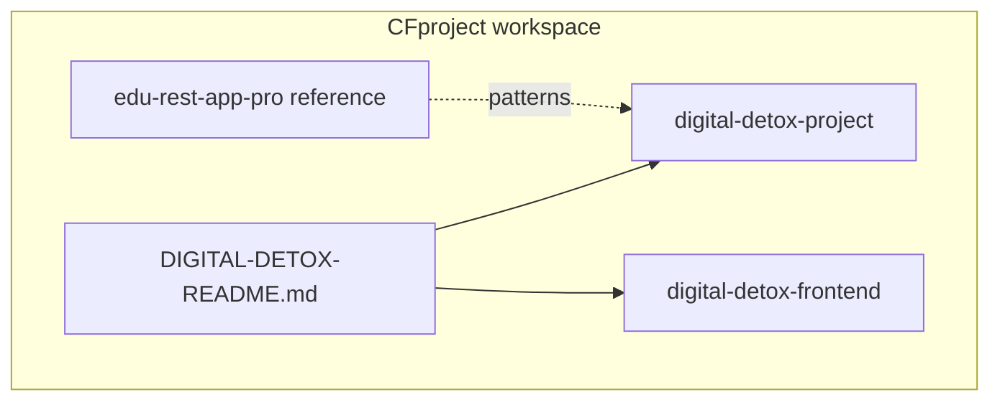

# CFproject

Workspace containing full-stack learning and portfolio projects.

## Featured project: Unplug (Digital Detox)

A **teen-focused digital wellness platform** where members build healthier screen habits with coach support — daily check-ins, goals, weekly reviews, and screenshot uploads.

| Layer | Path | Docs |
|-------|------|------|
| Full stack guide | — | [DIGITAL-DETOX-README.md](DIGITAL-DETOX-README.md) |
| REST API | `digital-detox-project/` | [README](digital-detox-project/README.md) |
| React UI | `digital-detox-frontend/` | [README](digital-detox-frontend/README.md) |



### Quick start

```bash
# 1. PostgreSQL — see DIGITAL-DETOX-README.md
# 2. Backend
cd digital-detox-project && ./gradlew bootRun

# 3. Frontend (new terminal)
cd digital-detox-frontend && npm install && npm run dev
```

- Frontend: [http://localhost:5173](http://localhost:5173)
- API / Swagger: [http://localhost:8080/swagger-ui.html](http://localhost:8080/swagger-ui.html)
- Demo admin: `admin` / `Admin123!`

## Other projects

| Project | Description |
|---------|-------------|
| `edu-rest-app-pro/` | Reference Spring Boot REST app (education domain) |
