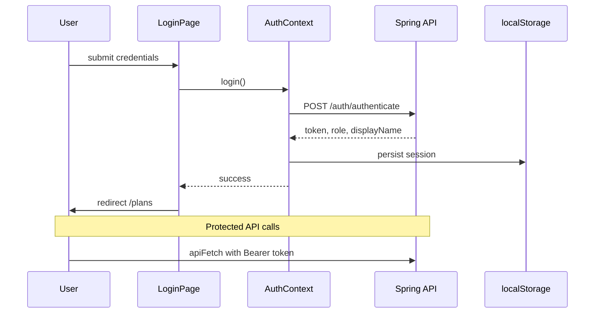
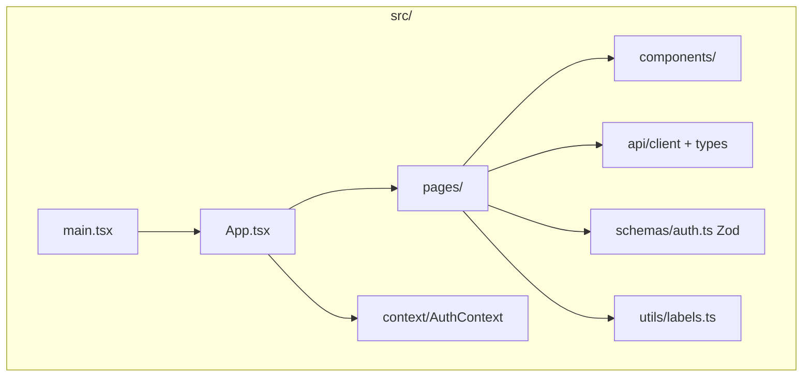

# Unplug — React Frontend

Teen-friendly React + TypeScript SPA for the Digital Detox / **Unplug** platform.

> **Full documentation:** [DIGITAL-DETOX-README.md](../DIGITAL-DETOX-README.md) — setup, demo walkthrough, API integration.

## Quick start

```bash
npm install
npm run dev
```

Open [http://localhost:5173](http://localhost:5173). The dev server proxies `/api` → `http://localhost:8080`.

**Requires the backend running** — see [digital-detox-project/README.md](../digital-detox-project/README.md).

## Stack

- React 19, TypeScript, Vite 8
- React Router 7
- **Zod** — runtime form validation
- **react-hook-form** + `@hookform/resolvers/zod`
- **JWT** — `localStorage`, sent via `apiFetch` / `apiDownload`

## UI design

Built for **teens** as the primary audience:

- Dark theme with vibrant purple / mint / coral accents
- Supportive, guilt-free copy (no streak pressure)
- Bento-style cards, rounded tactile components
- Emoji section headers for quick scanning
- Plus Jakarta Sans typography

## Routing

```mermaid
flowchart TD
  Root[/] --> Login[/login]
  Root --> Register[/register]
  Root --> Protected{JWT present?}
  Protected -->|no| Login
  Protected -->|yes| Plans[/plans]
  Plans --> Detail[/plans/:uuid]
  Protected --> Admin[/admin]
  Admin -->|not ADMIN| Plans
```

| Route | Access | Features |
|-------|--------|----------|
| `/login` | Public | Zod login, password visibility toggle |
| `/register` | Public | Member or coach tabs |
| `/plans` | Authenticated | Bento plan grid, filters, create (coach/admin) |
| `/plans/:uuid` | Authenticated | Goals, coach reviews, check-ins, upload/download |
| `/admin` | Admin only | Approve pending coaches |

## Auth flow



## Project structure



```
src/
├── api/           client.ts (fetch + JWT + download), types.ts
├── components/    Layout, PageHero, PasswordInput, ProtectedRoute
├── context/       AuthContext
├── pages/         Login, Register, Plans, PlanDetail, Admin
├── schemas/       Zod validation schemas
├── types/         Inferred form types
└── utils/         Friendly UI labels (status, risk, roles)
```

## Scripts

| Command | Description |
|---------|-------------|
| `npm run dev` | Dev server (port 5173) |
| `npm run build` | Typecheck + production build |
| `npm run preview` | Preview production build |
| `npm run lint` | ESLint |

## Environment

```env
VITE_API_BASE_URL=/api/v1
```
