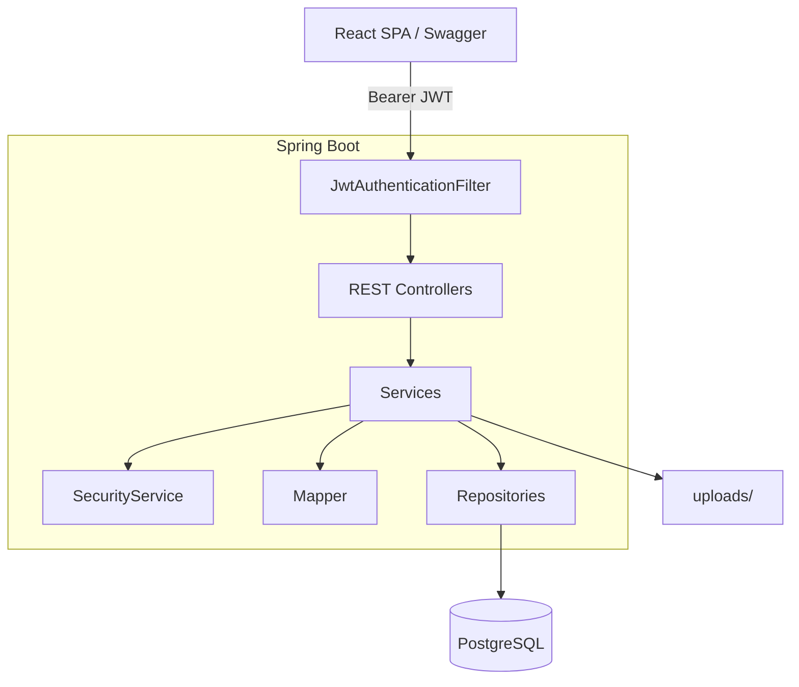
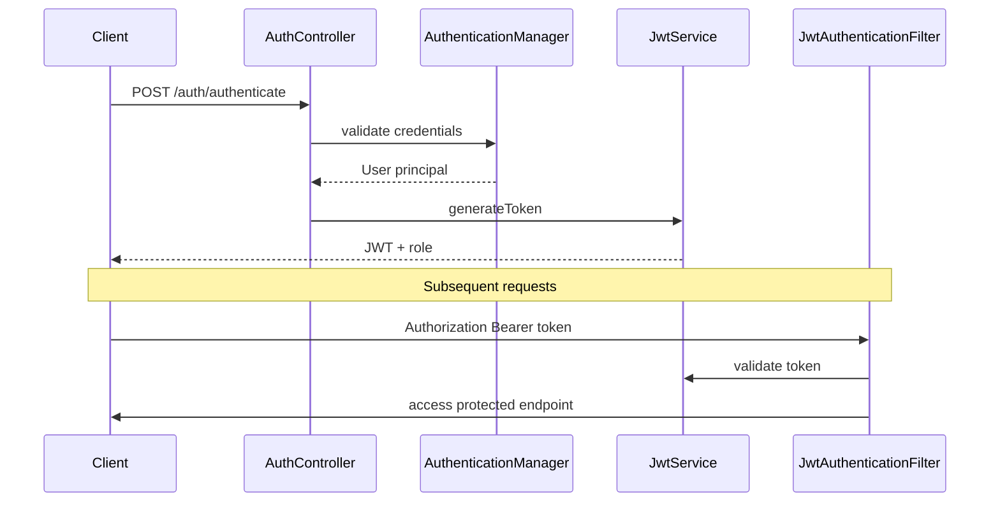
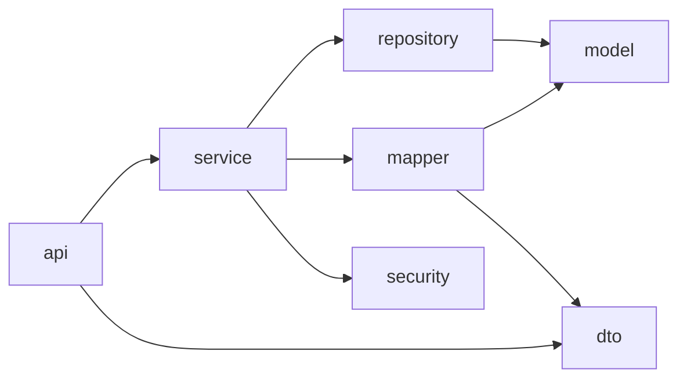
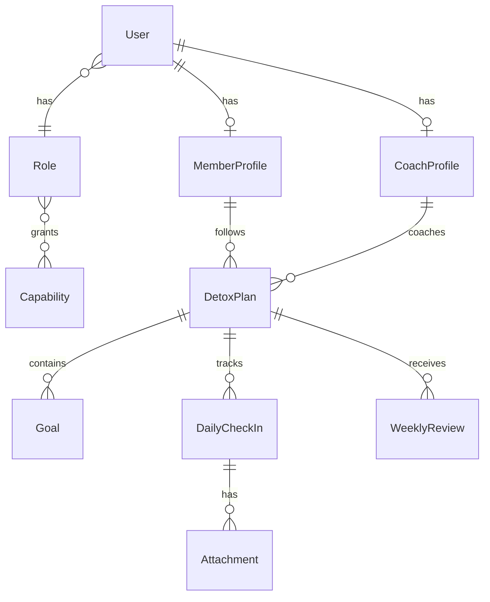

# Digital Detox — REST API

Spring Boot REST API for the **Unplug** digital wellness platform (`com.digitaldetox`).

> **Full documentation:** [DIGITAL-DETOX-README.md](../DIGITAL-DETOX-README.md) — architecture, API reference, demo flow, troubleshooting.

## Quick start

```bash
# 1. Create PostgreSQL database (see master README)
# 2. Run the API
./gradlew bootRun
```

| Resource | URL |
|----------|-----|
| API base | [http://localhost:8080/api/v1](http://localhost:8080/api/v1) |
| Swagger UI | [http://localhost:8080/swagger-ui.html](http://localhost:8080/swagger-ui.html) |
| OpenAPI JSON | [http://localhost:8080/v3/api-docs](http://localhost:8080/v3/api-docs) |
| Demo admin | `admin` / `Admin123!` |

## Stack

- Java 21, Spring Boot 3.5.14
- PostgreSQL + Flyway (`V1`–`V3`)
- JWT (jjwt 0.12.6), Spring Security, `@PreAuthorize`
- springdoc OpenAPI, Apache Tika (file type detection)

## Architecture



## Security flow



## Layered packages



| Package | Responsibility |
|---------|----------------|
| `api/` | REST controllers |
| `service/` | Business logic, `@PreAuthorize` |
| `repository/` | Spring Data JPA |
| `mapper/` | Entity ↔ DTO mapping (both directions) |
| `security/` | JWT filter, `SecurityConfiguration`, `SecurityService` |
| `dto/` | Request/response records + Bean Validation |
| `core/` | `ErrorHandler`, exceptions, filters |

## Domain model (simplified)



## Build & test

```bash
./gradlew build
./gradlew test
```

## Key config (`application-dev.properties`)

| Property | Default |
|----------|---------|
| DB | `jdbc:postgresql://localhost:5432/digitaldetox` |
| User / pass | `detox_user` / `detox_pass` |
| JWT expiration | 3 hours |
| Upload dir | `uploads/` |
| Max upload | 5 MB |
| CORS | `http://localhost:5173` |

## Validation approach

- **DTO annotations** — `@NotBlank`, `@Email`, `@Size`, etc. on insert/update records
- **Controllers** — `@Valid` + `BindingResult` → `ValidationException` → `400` with field errors
- **Services** — business rules (duplicates, ownership) via exceptions (`409`, `403`, `404`)

> The reference `edu-rest-app-pro` project also uses dedicated Spring `Validator` beans for DB-level checks — a pattern you can adopt for even more uniform field-level errors.
